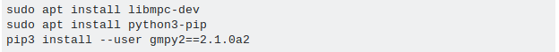

<h4>Linux (Ubuntu) </h4>

<ul>
	<li><a href="https://stackoverflow.com/questions/50474091/gmpy2-doesnt-install">gmpy2 install issue</a></li>
	<li><a href="https://packaging.python.org/tutorials/installing-packages/">Install Python Packages</a></li>
</ul>

<h3><a href="https://github.com/brandon-rowe/securitylab/blob/master/Setup-Pip-Python-env">Setup-Pip-Python-env</a></h3>
<h4>Linux (Ubuntu) </h4>
<ul>
	<li>My terminal steps</li>
	<li>Using Ubuntu 18.04.2</li>
	<li>This file is not necessary but can help people who are not familiar with linux terminal</li>
	<li>Need to be able to identify commands that you input vs what the terminal runs to do steps in order.</li>
	<li>Screenshot below shows how to identify my input.</li>
</ul>

<a href="http://www.howtobuildsoftware.com/index.php/how-do/HjQ/python-gmpy-is-gmpy2-suitable-for-implementing-rsa-in-python">gmpy2 implementing rsa</a>

<a href="https://gmpy2.readthedocs.io/en/latest/mpz.html">Precision Calculations with gmpy2</a>

