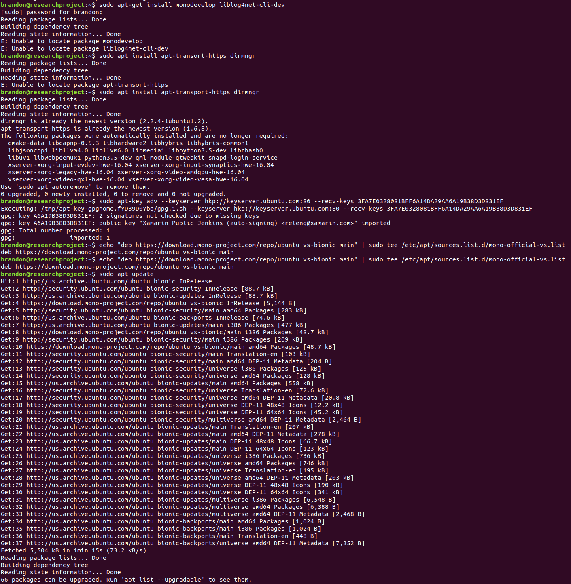

#Setup LOIC

#Ended up downloading exe on Windows for easy testing.

#Need to find an alt test site. My GoDaddy site did not seem phased. Could not see any noticable difference in accessibility.

<h4>Links</h4>

<ol>
  <li><a href="https://www.youtube.com/watch?v=DDC9_RqRLGA">Good Demo</a></li>
  <li><a href="https://pastebin.com/mp2g6m1w">LOIC Setup Guide</a></li>
  <li><a href="https://www.youtube.com/watch?v=wtnbbOO7OoQ">Easy Video Guide</a></li>
  <li><a href="https://github.com/NewEraCracker/LOIC">LOIC Software</a></li>
  <li><a href="https://www.longren.io/how-to-use-low-orbit-ion-cannon-on-linux/">LOIC Alt Setup Guide</a></li>
  <li><a href="https://www.monodevelop.com/download/">Monodevelop Setup</a></li>
  <li><a href="https://gbhackers.com/anonymous-ddos-a-website-using-kali-linux/">Kali Linux Attack</a></li>
  <li><a href="https://gbhackers.com/kali-linux-tutorial-dos-attack/">Metasploit Attack</a></li>
  <li><a href="https://linuxhint.com/ddos-attack-testing/">Goldeneye Attack</a></li>
</ol>

